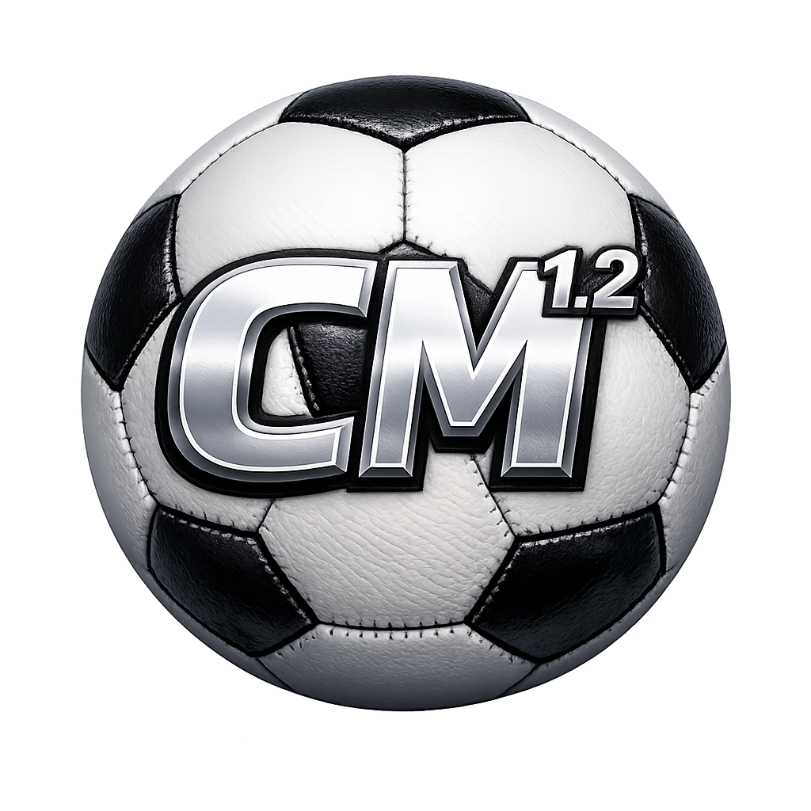

<p align="center">
  
</p>

<div align="center">
  <h1>ClipMaker</h1>

  **Football video clipping and analysis workstation built from match event data**

Built by [@B03GHB4L1](https://x.com/B03GHB4L1)

Current version: **v1.2.3**
</div>

---

## What it does

ClipMaker turns match event data and match video into a local football analysis and clipping workflow.

You can use it to:

- scrape match events from WhoScored or Scoresway
- load your own event CSV and match video files
- explore the match inside an interactive Analyst Room
- profile team style, transitions, and set pieces inside the Tactical Lab
- filter events manually or with AI-assisted prompts
- generate individual clips or a combined highlight reel automatically

It started as a clip cutter. In `v1.2.3`, it is much closer to a full analyst toolkit.

---

## Core Features

### Data ingestion

- **WhoScored scraper built in** — load a match directly from a WhoScored URL
- **Scoresway scraper built in** — paste Scoresway match URLs and let ClipMaker normalize the event data into the same workflow
- **CSV import workflow** for your own event data
- **Single-file or split-video support** for one full match file, separate half files, extra-time files, and penalty shootout files
- **Kick-off timestamp mapping** for 1st half, 2nd half, extra time, and penalties where needed
- **First penalty timestamp mapping** so penalty shootouts can be aligned more reliably

### Clipping and output

- **Automatic clip generation** from event timestamps
- **Individual clips or combined reel** output
- **Dry run mode** to preview clip windows before rendering
- **Merge-gap logic** to combine nearby actions into cleaner sequences
- **Live progress feedback** during clip rendering and reel assembly
- **FFmpeg-based cutting and concatenation** for faster and more reliable output handling
- **Improved event ordering and match-clock mapping** across normal time, extra time, and shootouts

### Manual filtering

- **Multi-player reel building** from the Manual Filters tab
- **Action type filters** for passes, carries, shots, defensive actions, and more
- **xT threshold filter**
- **Top N by xT**
- **Progressive action filter**
- **Half filter**
- **Pitch zone filter**
- **Depth zone filter**
- **Boolean event filters** such as:
  - key passes
  - crosses
  - long balls
  - switches of play
  - diagonals
  - through balls
  - deep completions
  - box entry passes
  - final third entries
  - big chances created
  - assist sub-types
  - touch in box
  - and other computed football event flags

### AI-assisted filtering

- **ClipMaker AI tab** for natural-language clip requests
- **Deterministic + LLM hybrid query pipeline**
  - first resolves teams, players, halves, event types, and boolean tags using code
  - then uses an LLM layer for interpretation and response generation
- **Natural-language filter parsing** into app filter settings
- **AI-generated clip outputs** with downloadable rendered clips/reels
- **Football glossary and alias system** to improve prompt understanding
- **Expanded football query support** for switches, diagonals, box entries, final-third entries, touch-in-box actions, penalties, and successful take-ons in the box
- **Proxy-backed model fallback flow** for the AI layer

### Workflow helpers

- **Quick filter presets** like set pieces, ball progression, attacking chaos, and defensive display
- **Filter snapshots** so users can save and reload filter configurations across sessions
- **Browser-based local UI** built in Streamlit
- **PNG and animated GIF exports** for interactive analysis maps
- **Cleaner chart export names, titles, match context, and ClipMaker branding**
- **Packaged launchers** for Windows, macOS, and Linux

---

## Analyst Room

The Analyst Room is a separate multi-view analysis workspace inside the app.

It includes:

- **Shot Map**
  - normal shot view
  - goalframe view
  - penalty shootout mode
- **Pass Map**
  - player pass view
  - pass network view
- **Defensive Actions Map**
- **Dribbles & Carries Map**
- **Goalkeeper Map**
  - actions view
  - shots faced view
- **Build-Up View**
  - progressive chain detection
  - chain inspection and clip extraction
- **Player Comparison**
  - comparison radar
  - role-aware comparison logic
  - Top 5 Moments widgets

Recent improvements also include:

- professional goalframe proportions
- adaptive goalframe scaling for out-of-frame shots
- dedicated penalty shootout layout
- chronological shootout ordering
- wrapped shootout rows after 5 penalties
- export-ready map context with match, team, player, and filter labels
- cleaner PNG exports for charts and maps

---

## Tactical Lab

The Tactical Lab is a team-level analysis workspace for style and phase-of-play profiling.

It includes:

- **Multi-match team analysis**
  - select up to 20 saved matches
  - compare team style across a wider sample
- **Style Profile radar**
  - possession control
  - PPDA-based pressing intensity
  - directness
  - wide play share
  - final-third penetration
  - set-piece reliance
  - transition threat
- **Radar Info** explanations for every radar metric
- **Threat split chart** showing pass xT versus carry xT
- **Progression Funnel** showing territory gain and final-third/box progression
- **Territory Heatmap** for team field tilt and area usage
- **Defensive Transitions**
  - possession-loss locations
  - recovery, progression conceded, box entry conceded, and shot conceded outcomes
- **Attacking Transitions**
  - recovery locations
  - threat and progression after ball-wins
- **Set-Piece and Restart Profile**
  - restart delivery map
  - restart mix and outcome table
  - corner normalization so `Corner` and `CornerAwarded` are treated as one restart type
- **Video Lab**
  - cut tactical moments directly from transition, xT, box-entry, and restart playlists
  - build tactical reels from selected moments
- **Export polish**
  - chart titles, notes, filenames, and branding are prepared for presentation use

---

## Download

Go to the [Releases](../../releases) page and download the package for your platform:

- **Windows**
- **macOS**
- **Linux**

## Or clone only one platform folder

### Windows
```bash
git clone --filter=blob:none --no-checkout https://github.com/B03GHB4L1/ClipMaker.git
cd ClipMaker
git sparse-checkout init --cone
git sparse-checkout set Windows
git checkout main
```

### macOS
```bash
git clone --filter=blob:none --no-checkout https://github.com/B03GHB4L1/ClipMaker.git
cd ClipMaker
git sparse-checkout init --cone
git sparse-checkout set Mac
git checkout main
```

### Linux
```bash
git clone --filter=blob:none --no-checkout https://github.com/B03GHB4L1/ClipMaker.git
cd ClipMaker
git sparse-checkout init --cone
git sparse-checkout set Linux
git checkout main
```

Each package includes platform-specific setup instructions and launchers.

---

## Requirements

- Python 3.10 or later recommended
- Match video file(s)
- Event CSV data, a WhoScored match URL, or a Scoresway match URL

Packaged launchers handle first-run dependency setup for supported builds.

---

## How it works

1. Load a match by scraping WhoScored, scraping Scoresway, or importing your own CSV
2. Load the match video file, separate half files, or separate extra-time/penalty files where needed
3. Enter kick-off timestamps that match your video timeline
4. Explore the match in the Analyst Room or go straight to filtering
5. Build your export using manual filters or AI prompts
6. Render either individual clips or a combined reel

ClipMaker maps event times to the video timeline, builds clip windows around the selected moments, merges nearby events when appropriate, and exports the final result locally. For penalty shootouts, users can enter the timestamp of the first penalty kick and ClipMaker derives the period anchor from the match data.

---

## CSV Format

Minimum required columns:

| Column | Description |
|--------|-------------|
| `minute` | Match clock minute |
| `second` | Match clock second |
| `type` | Event type, e.g. `Pass`, `Carry`, `Shot` |
| `period` | Half identifier, e.g. `FirstHalf` / `SecondHalf` or `1` / `2` |

Useful optional columns:

| Column | Unlocks |
|--------|---------|
| `xT` | xT threshold filters and Top N by xT |
| `prog_pass` | Progressive pass filtering |
| `prog_carry` | Progressive carry filtering |
| `goal_mouth_y` | Goalframe shot placement views |
| `goal_mouth_z` | Goalframe shot placement views |
| `team` | Team filtering and comparison features |
| `playerName` | Player filtering, AI prompts, comparison, and map views |
| computed `is_*` flags | Rich boolean filters and AI-assisted interpretation |

---

## Data Source Notes

- WhoScored and Scoresway data do not always contain identical event tags or qualifiers.
- Scoresway matches are normalized into the ClipMaker workflow, but some analysis outputs may differ slightly from the equivalent WhoScored workflow.
- All clipping and video rendering still happens locally on your machine.

---

## Changelog

### v1.2.3

- Added **Scoresway scraping** alongside WhoScored, with automatic source detection from pasted match URLs
- Added **Scoresway event normalization** for xT, progressive actions, carries, box entries, goalkeeper actions, set pieces, and shot/save classification where available
- Added **PNG and animated GIF export controls** for interactive analysis maps
- Improved **extra-time and penalty shootout handling**, including optional separate files for extra-time halves and shootouts
- Added easier **penalty shootout timestamp alignment** using the first penalty kick timestamp
- Expanded the **Tactical Lab** with multi-match selection, transition analysis, style profiles, progression funnels, territory heatmaps, restart profiles, and tactical video playlists
- Improved **Analyst Room exports** with clearer titles, match context, labels, notes, filenames, and ClipMaker branding
- Improved **AI and manual filtering** for xT, progressive actions, switches, diagonals, box entries, final-third entries, penalties, and touch-in-box queries
- Improved event ordering, timestamp conversion, and handling of missing or incomplete event clocks
- Improved macOS file handling with browser-safe upload controls

### v1.2.2

- Added the **Tactical Lab** for team style, transition, and set-piece analysis
- Added **multi-player reels** in the Manual Filters tab
- Normalized `Foul + Successful` events to **Foul Drawn**
- Added **multi-match scraping**
  
### v1.2.1

- Added a **Pressing Map** to The Analyst's Room for viewing high ball-wins by press zone
- Added a **timeline scrubber** and per-clip buffer controls so individual clips can be trimmed and re-cut directly from preview
- Improved manual filtering with smarter qualifier options that only appear when relevant to the current player, team, and action type
- Made clip previews load faster by streaming videos instead of loading whole files into memory
- Added clearer controls for dismissing AI video output and individual clip previews
- Fixed individual clip and highlight reel download issues
- Cleaned up filter labels while preserving compatibility with saved v1.2 filters

### v1.2

- Expanded from a simple clip generator into a **multi-page analysis + clipping app**
- Added **WhoScored scraping**
- Added the **Analyst Room**
- Added **Shot Map**, **Pass Map**, **Defensive Actions**, **Dribbles & Carries**, **Goalkeeper**, **Build-Up**, and **Comparison** views
- Added **Penalty Shootout analysis**
- Added **ClipMaker AI** with natural-language filtering and AI-generated clip workflows
- Added **quick presets** and **filter snapshots**
- Added richer computed football event flags and query parsing
- Improved packaged launchers and first-run setup flow
- Added custom frontend map components, local assets, and stronger theming

### v1.1

- Action type, progressive, xT, and Top N filters
- Split video file support
- Half filter
- Live assembly progress bar with ETA
- Finalising message during muxing
- Switched from MoviePy-heavy output flow to direct FFmpeg-based cutting and assembly for faster rendering and better multi-audio support

### v1.0

- Initial release
- Auto clip cutting and merging from event CSV
- Combined reel and individual clips modes
- Dry run preview
- Browser UI with file browse buttons

---

*ClipMaker by B4L1 — [@B03GHB4L1](https://x.com/B03GHB4L1)*
